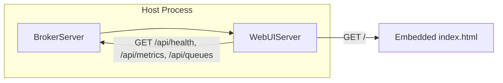
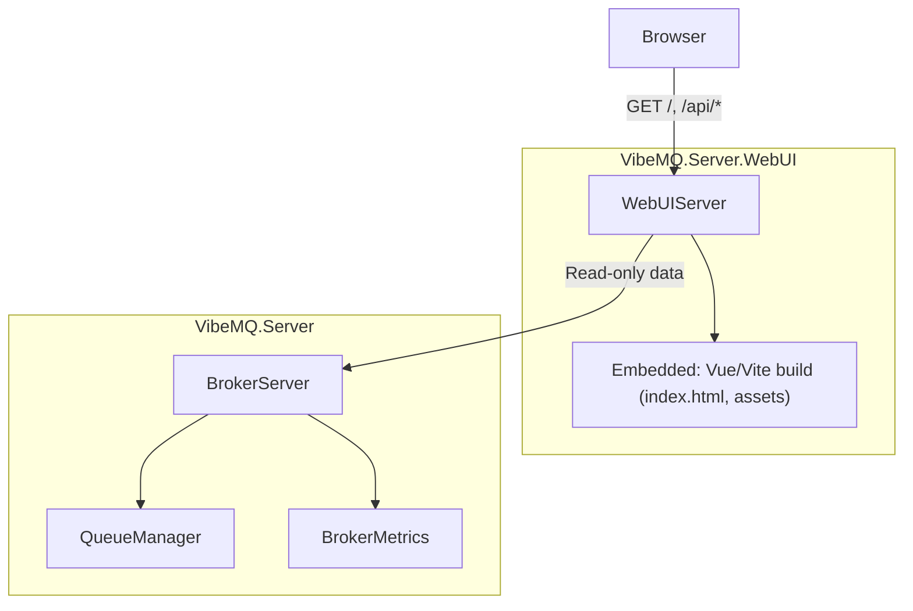

# Веб-интерфейс управления (Web UI)

**Описание:** Веб-админка для мониторинга и управления брокером.

---

# Архитектурное решение: Web UI для VibeMQ

## 1. Контекст и ограничения

- **Контекст**: добавление веб-дашборда для мониторинга брокера (очереди, метрики, здоровье, подключения).
- **Ограничения**: минимум зависимостей; отдельная сборка; весь интерфейс упакован в эту сборку; удобство использования (простое подключение и понятный UI).

Текущий стек: [VibeMQ.Server](src/VibeMQ.Server) и [VibeMQ.Core](src/VibeMQ.Core) уже используют **HttpListener** для health/metrics ([HealthCheckServer.cs](src/VibeMQ.Core/Health/HealthCheckServer.cs)), без ASP.NET Core. Есть готовые данные: [HealthStatus](src/VibeMQ.Core/Health/HealthStatus.cs), [MetricsSnapshot](src/VibeMQ.Core/Metrics/MetricsSnapshot.cs), [IQueueManager](src/VibeMQ.Core/Interfaces/IQueueManager.cs) (ListQueuesAsync, GetQueueInfoAsync), [QueueInfo](src/VibeMQ.Core/Models/QueueInfo.cs).

---

## 2. Рассмотренные варианты

### 2.1 HTTP-слой

| Вариант | Суть                                                                                  | Плюсы                                                         | Минусы                                         |
| ------- | ------------------------------------------------------------------------------------- | ------------------------------------------------------------- | ---------------------------------------------- |
| **A**   | Расширить HealthCheckServer в Core: добавить маршруты `/`, `/api/*` и раздачу статики | Один порт, один процесс, без новых зависимостей               | Core усложняется, смешиваются health и UI      |
| **B**   | Отдельный HttpListener в сборке WebUI на своём порту                                  | Core и Server не трогаем, UI изолирован, минимум зависимостей  | Два порта (broker, health, webui)              |
| **C**   | Минимальный ASP.NET Core (Kestrel) в отдельной сборке                                  | Привычный стек для .NET                                       | Противоречит требованию «минимум зависимостей» |

**Выбор: B** — отдельный **HttpListener в сборке WebUI**, свой порт. Core и Server остаются без изменений. Порт дашборда: **12925** (фиксированный по умолчанию в опциях).

### 2.2 Фронтенд

| Вариант | Суть                                          | Плюсы                                         | Минусы                                                |
| ------- | --------------------------------------------- | --------------------------------------------- | ----------------------------------------------------- |
| **1**   | Только HTML + CSS + JS (vanilla)               | Нет сборки и внешних зависимостей             | Больше ручного кода для обновлений и взаимодействия   |
| **2**   | Одна HTML-страница + Alpine.js или htmx с CDN  | Мало кода, реактивность/обновления без сборки | Зависимость от CDN (можно отдать в embedded fallback)  |
| **3**   | SPA на Vue 3 + Vite                           | Удобная разработка, компоненты, роутинг       | Требуется npm и шаг сборки при релизе                 |

**Выбор: 3** — **SPA на Vue 3 + Vite**. Исходники фронта в подпапке (например `App/` или `frontend/`); `npm run build` выдаёт статику в `dist/`, которая при сборке .NET проекта копируется/встраивается в assembly как embedded resources. В рантайме Node не нужен — HttpListener раздаёт готовые файлы из ресурсов.

### 2.3 Интеграция с брокером

- **Вариант I**: Хост сам создаёт и запускает `WebUIServer(broker, options)` рядом с `broker.RunAsync()` (например, `Task.WhenAll`).
- **Вариант II**: Расширение на `BrokerServer`: `await broker.RunWithWebUIAsync(webUiPort)` — внутри запуск брокера и Web UI в одном вызове.

**Выбор: оба** — предоставить и конструктор `WebUIServer(BrokerServer, WebUIOptions)`, и метод расширения `RunWithWebUIAsync` для удобства «одной строки».

---

## 3. Критерии решения

- **Минимум зависимостей в рантайме** — без ASP.NET; Node/npm только на этапе сборки фронта.
- **Отдельная сборка** — проект `VibeMQ.Server.WebUI`, ссылается только на `VibeMQ.Server` (и транзитивно Core).
- **Всё в сборке** — результат Vite build (HTML/CSS/JS) встраивается в assembly как embedded resources.
- **Порт** — Web UI по умолчанию на порту **12925** (настраивается в опциях).
- **Удобство** — включение за счёт одной настройки (порт, путь) и одного вызова (RunWithWebUIAsync или явный запуск WebUIServer).

---

## 4. Решение

### 4.1 Структура

- **Новый проект**: `src/VibeMQ.Server.WebUI/`
  - Ссылка только на [VibeMQ.Server](src/VibeMQ.Server) (доступ к BrokerServer, данным для дашборда).
  - **Бэкенд**: класс `WebUIServer` — свой **HttpListener** в этой сборке, цикл Accept, маршрутизация (статика + `/api/*`).
  - **Фронт**: подпапка `App/` (или `frontend/`) — проект Vue 3 + Vite; вывод сборки (`dist/`) встраивается в assembly (например через `<EmbeddedResource>` или копирование в output + embed). В рантайме раздаётся только статика из ресурсов.
  - **Опции** (`WebUIOptions`): порт (по умолчанию **12925**), путь префикса (например `/`), включение/выключение.

### 4.2 Стек

- **HTTP-слой**: **HttpListener** в сборке WebUI (не в Core), порт по умолчанию **12925**. Сериализация: `System.Text.Json`.
- **Фронт**: **Vue 3 + Vite** — SPA; при сборке .NET артефакты Vite (`dist/`) попадают в assembly как embedded resources, HttpListener отдаёт `index.html` и статику (JS/CSS) по путям вроде `/`, `/assets/*`.
- **Зависимости .NET-проекта**: только `VibeMQ.Server` (+ при необходимости `Microsoft.Extensions.Logging.Abstractions`). Зависимости Node (Vue, Vite) — только для разработки/сборки фронта, не в NuGet.

### 4.3 API дашборда

- `GET /api/health` — JSON, аналог текущего health (можно собрать из BrokerServer: ActiveConnections, InFlightMessages, QueueCount, метрики, MemoryUsageMb, IsHealthy).
- `GET /api/metrics` — JSON [MetricsSnapshot](src/VibeMQ.Core/Metrics/MetricsSnapshot.cs) от `BrokerServer.Metrics.GetSnapshot()`.
- `GET /api/queues` — список имён (через `IQueueManager.ListQueuesAsync`); для дашборда без auth можно использовать внутренний QueueManager (доступен через BrokerServer).
- `GET /api/queues/{name}` — один [QueueInfo](src/VibeMQ.Core/Models/QueueInfo.cs) через `GetQueueInfoAsync`.

Корень `GET /` и запросы к SPA (Vue Router) — отдача `index.html` из embedded resources; `GET /assets/*` — JS/CSS из ресурсов.

### 4.4 Внешний вид (Vue SPA)

- **Стиль**: нейтральный «админский» дашборд: заголовок (VibeMQ Dashboard), статус (healthy/unhealthy), блоки-карточки для сводки (подключения, очереди, in-flight, память, uptime, throughput, latency).
- **Очереди**: таблица (имя, message count, subscribers, delivery mode, max size, createdAt).
- **Тема**: CSS-переменные для светлой/тёмной темы, читаемый шрифт.
- **Обновление**: опциональный polling раз в N секунд для /api/health и /api/queues (реализуется во Vue-компонентах).

---

## 5. Последствия

- **Плюсы**: один NuGet-пакет и один вызов для включения дашборда; нет новых тяжёлых зависимостей; Core и Server не меняются; обновления дашборда — только замена ресурсов в WebUI.
- **Минусы**: добавление новых страниц или API — правки в WebUI и пересборка; для обновления UI нужна пересборка фронта (Vite) и .NET-проекта; отдельный порт 12925 (и при необходимости firewall).
- **Ограничения**: дашборд рассчитан на доверенную сеть; при необходимости позже можно добавить опциональную HTTP Basic auth в WebUIServer.
- **Сборка**: перед сборкой .NET-проекта WebUI нужно выполнить `npm run build` в папке фронта, чтобы `dist/` был актуален; в .csproj настроить копирование/embed содержимого `dist/` (или использовать pre-build target для вызова npm).
- **Следующие шаги**: (1) определение контракта доступа к данным брокера из WebUIServer (BrokerServer уже даёт Metrics, ActiveConnections, InFlightMessages; для списка очередей нужен доступ к IQueueManager — возможно, добавить на BrokerServer методы для дашборда или интерфейс IDashboardDataProvider); (2) обновление документации и changelog по правилам проекта; (3) при необходимости — русская локализация строк в UI.

---

## 6. Диаграмма компонентов

**Примечание:** сегодня у `BrokerServer` нет публичного доступа к `IQueueManager` для внешнего кода. Для дашборда потребуется либо добавить в BrokerServer публичный метод/свойство для доступа к списку очередей и QueueInfo (например `GetQueuesForDashboardAsync()`), либо ввести тонкий интерфейс в Core/Server, который внедряется в WebUIServer и реализуется внутри Server. Это уточняется на этапе реализации.

---

## 7. Расширение Web UI: просмотр очереди и управление сообщениями (план)

**Цель:** в интерфейсе дашборда добавить возможность открыть очередь, просмотреть сообщения, удалять сообщения и удалять очередь. Только обновление роадмапа; реализация — отдельным этапом.

### 7.1 Требуемый UX

- **Открытие очереди:** из таблицы очередей — клик по имени очереди (или кнопка «Open» / «View») → переход на страницу/экран детализации очереди.
- **Просмотр сообщений:** на экране очереди — список сообщений (peek, без потребления): идентификатор, время, размер/превью тела, опционально приоритет и заголовки.
- **Просмотр тела сообщения:** по клику на сообщение — модальное окно или раскрывающаяся строка с полным телом (JSON/text), копирование.
- **Удаление сообщений:** действие «Delete» у одного сообщения; опционально выбор нескольких и массовое удаление.
- **Удаление очереди:** на экране очереди кнопка «Delete queue» с подтверждением (ввод имени очереди или «Delete»). После удаления — возврат к списку очередей.
- **Purge (опционально):** кнопка «Purge all messages» — очистка всех сообщений в очереди без удаления самой очереди.

### 7.2 Что уже есть в брокере

- **Удаление очереди:** [IQueueManager.DeleteQueueAsync](src/VibeMQ.Core/Interfaces/IQueueManager.cs), [DeleteQueueHandler](src/VibeMQ.Server/Handlers/DeleteQueueHandler.cs). Для Web UI нужен доступ к этой операции через BrokerServer (или тонкий admin-API).
- **Список сообщений в очереди:** [IStorageProvider.GetPendingMessagesAsync(queueName)](src/VibeMQ.Core/Interfaces/IStorageProvider.cs) возвращает pending-сообщения по имени очереди. Внутри сервера также есть [MessageQueue.PeekAll()](src/VibeMQ.Server/Queues/MessageQueue.cs). Для дашборда нужен безопасный способ «только чтения» списка (peek) без изменения состояния доставки.
- **Удаление одного сообщения:** [IStorageProvider.RemoveMessageAsync(id)](src/VibeMQ.Core/Interfaces/IStorageProvider.cs). Удаление из хранилища может быть недостаточно, если сообщение уже есть в памяти очереди — нужна согласованность с [QueueManager](src/VibeMQ.Server/Queues/QueueManager.cs) / очередью (чтобы сообщение не ушло подписчику после «удаления» в UI).
- **Purge:** в [QueueOperation](src/VibeMQ.Core/Enums/QueueOperation.cs) есть `PurgeQueue`; наличие обработчика и контракта в IQueueManager/IStorageProvider уточняется при реализации.

### 7.3 Предполагаемый API (Web UI → WebUIServer)

| Метод | Путь | Назначение |
| ----- | ---- | ---------- |
| GET | `/api/queues/{name}/messages` | Список сообщений в очереди (peek). Query: `?limit=50&offset=0`. Ответ: массив сообщений (id, timestamp, body preview/size, headers, priority). |
| GET | `/api/queues/{name}/messages/{messageId}` | Одно сообщение (полное тело) для просмотра в UI. |
| DELETE | `/api/queues/{name}/messages/{messageId}` | Удалить одно сообщение из очереди. |
| DELETE | `/api/queues/{name}/messages` | Purge: удалить все сообщения в очереди (опционально). |
| DELETE | `/api/queues/{name}` | Удалить очередь (и все её сообщения). Требует подтверждения на стороне UI. |

Все мутирующие операции (DELETE) должны выполняться только при наличии соответствующих возможностей у брокера и, при необходимости, с учётом авторизации (дашборд в доверенной сети; при появлении auth — только admin).

### 7.4 Необходимые доработки бэкенда (без реализации сейчас)

- **BrokerServer (или слой дашборда):** экспозить для Web UI: (1) получение списка сообщений очереди (peek) с учётом лимита/офсета; (2) удаление одного сообщения из очереди с согласованностью памяти и хранилища; (3) удаление очереди (уже есть через IQueueManager); (4) при наличии — purge очереди. Возможные варианты: новые методы на BrokerServer только для дашборда, либо отдельный «admin»-интерфейс в Core/Server, который WebUIServer вызывает.
- **Согласованность при удалении сообщения:** определить, как удалять сообщение так, чтобы оно не осталось в in-memory очереди и не было доставлено после удаления из storage (возможно, флаг «удалено» или удаление из обоих мест в рамках одной операции в QueueManager).
- **Авторизация:** дашборд пока для доверенной сети; при добавлении HTTP Basic или ролей — ограничить опасные операции (delete queue, purge, delete message) только для администраторов.

### 7.5 Фронт (Vue)

- Маршрут вида `/queues/:name` — экран детализации очереди.
- Компоненты: список сообщений (таблица/карточки), модальное окно или drawer для тела сообщения, кнопки Delete (одно/несколько), Purge, Delete queue с подтверждением.
- Вызовы новых API при загрузке экрана очереди, после удаления/ purge — обновление списка и метаданных очереди (или редирект на список очередей при удалении очереди).

### 7.6 Риски и открытые вопросы

- **Производительность:** большие очереди — список сообщений с пагинацией (limit/offset) и без загрузки полных тел в список.
- **Порядок сообщений:** явно определить, что возвращает «список сообщений» (только из storage, только из памяти, объединённый слой) и как это соотносится с порядком доставки.
- **DLQ:** отдельно рассмотреть отображение DLQ и операций над dead-letter сообщениями (просмотр, удаление) в том же или следующем расширении.
